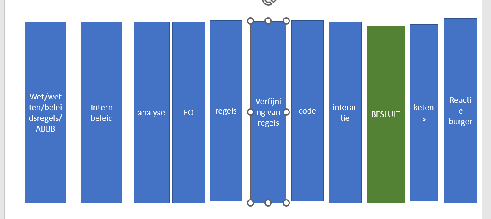
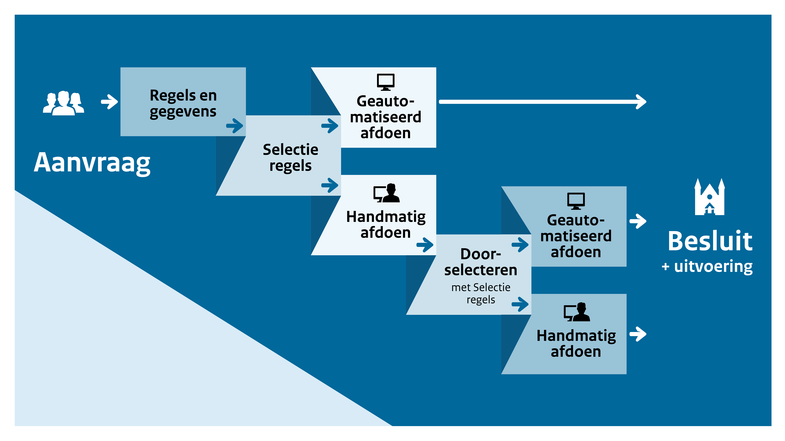

# De LegitiMaat

# Introductie

De overheid heeft veel verschillende taken. Deze taken worden bij wet toegekend aan een bestuursorgaan. Een deel van deze wettelijke taken wordt geautomatiseerd uitgevoerd met algoritmen. Denk aan het opleggen van boetes voor te hard rijden, het terugvorderen van toeslagen of het verlenen van AOW of kinderbijslag. Net als bij een meer zichtbare uitvoering van taken zoals het ophogen van dijken, is het belangrijk om te weten hoe deze processen verlopen en welke keuzen daarbij gemaakt zijn. Want ook de geautomatiseerde uitvoering van wetten is publiek handelen en moet legitiem zijn.

Met de LegitiMaat kan de uitvoerende overheid verantwoording afleggen en kunnen anderen zich er een mening over vormen. ‎ De LegitiMaat is bedoeld om te _waarderen_, zodat de organisatie zich kan ontwikkelen en verbeteren. Het is een visitatie-instrument. [link naar stuk over visitatie]

## _Voor wie is het bedoeld?_

De LegitiMaat is een werkmethode om de geautomatiseerde uitvoering van wetten door de overheid op een gestandaardiseerde manier inzichtelijk te maken en te (laten) beoordelen. De LegitiMaat gaat uit van het vakmanschap van de medewerkers bij de bestuursorganen en van de toenemende vraag in de samenleving dat de overheid rekenschap aflegt over onzichtbare processen.

Het is bedoeld voor publieke organisaties die wetten geautomatiseerd uitvoeren en besluiten nemen in individuele gevallen. Zij kunnen inzicht te geven over _bestaande_ processen. Ook kunnen zij een visitatie-team met beoordelaars van andere overheidsorganisaties uitnodigen om onderzoek te doen zodat de organisatie weet wat ontwikkeld kan worden of verbeterd.

Bij _nieuw_ te ontwikkelen van ITsystemen kunnen zij direct zien wat zij moeten vastleggen om inzicht te geven.

De LegitiMaat is ook bedoeld voor beoordelaars. De juristen, auditors en collega-ontwikkelaars die inzicht nodig hebben en een waardering moeten geven over de manier waarop het bestuursorgaan wetten geautomatiseerd uitvoert.

## _Hoe kan ik een bijdrage leveren?_

Op 1 juli 2022 is het prototype aangeboden aan het ministerie van BZK en gepubliceerd op GitHub. De werkmethode is werkende weg ontwikkeld, getest en aangepast. Meer informatie over het proces en de literatuur die is gebruikt: LINK naar PLEIO. We ontvangen graag verbeteringen! Neem contact op met: XXX

# Een methode om te evalueren en te leren

De LegitiMaat gaat uit van de principes van visitatie-onderzoek. Het is een visitatie-instrument [LINK naar stuk over visitatie]. Dit betekent dat een groot deel van het onderzoek wordt neergelegd bij de expert zelf, het bestuursorgaan.

In De LegitiMaat wordt aangegeven welke documenten nodig zijn, de LegitiMaat documentenlijst [LINK naar wat en wie] en welke vragen vooraf beantwoord moeten worden, de LegitiMaat vragenlijsten [link naar de vragenlijsten].

Het visitatie-team dat vervolgens aan de slag gaat, zal interviews houden en steekproeven nemen.

De LegitiMaat is een belangrijke stap om transparant te zijn en rekenschap en verantwoording af te leggen over het gebruik van algoritmen bij geautomatiseerde uitvoering van wetten.

## _Interdisciplinair en generiek_

Het is niet zinvol als iedereen vanuit zijn eigen discipline verschillende eisen stelt. Het is ook niet efficiënt als elke overheidsorganisatie zelf moet nadenken over welke vragen iemand zou kunnen hebben. De LegitiMaat is daarom een integrale methode die geschikt is voor drie disciplines voor verschillende overheidsorganisaties. Ook is de werkmethode geschikt voor herhaald gebruik bij verschillende publieke organisaties.

Met De LegitiMaat kan:

- een jurist een uitspraak doen over de juridische rechtmatigheid [link naar begrippenlijst] en behoorlijkheid van de geautomatiseerde uitvoering,
- een informatiekundige een uitspraak doen over de kwaliteit van de geautomatiseerde uitvoering,
- een accountant of interne controller een uitspraak doen over de financiële rechtmatigheid [link naar de begrippenlijst] van de geautomatiseerde uitvoering.

## _Relatie met andere initiatieven_

Er gebeurt van alles op het terrein van algoritmen bij de overheid. Zo wordt er gewerkt aan een algoritmeregister en hanteert de overheid een open source beleid [LINK naar begrippenlijst] Ook wordt steeds vaker over toezicht op algoritmen gesproken. Maar een beoordeling kan pas gegeven worden als de overheidsorganisatie eerst zelf inzicht heeft in het eigen complexe en zeer (wets)technische proces.

# Hoe worden wetten geautomatiseerd uitgevoerd?

Als de overheid besluiten neemt in individuele gevallen waarbij het gaat om grote aantallen en veel vergelijkbare repeterende taken, gaat dit vaak geautomatiseerd. Hiervoor moet de wet vertaald worden en moet bepaald worden hoe de wet wordt uitgevoerd. Na gesprekken met de professionals hebben we dit proces in de volgende stappen onderscheiden.

Deze procesplaat is een illustratie, geen voorschrift. Elke organisatie zal het proces op een eigen manier hebben ingericht. Dat blijft in stand. De procesplaat en de onderverdeling in De LegitiMaat, is een manier om het gesprek te voeren.

## _Geautomatiseerde besluiten of beslissingsondersteuning?_

‎De LegitiMaat gaat over de geautomatiseerde uitvoering van wetten door de overheid. Hierbij maken we een onderscheid tussen besluiten die zonder menselijke tussenkomst worden genomen (gladde gevallen) en besluiten die gedeeltelijk met menselijke tussenkomst worden genomen (niet-gladde gevallen/uitval/uitworp). In het laatste geval fungeren de algoritmen ter ondersteuning van de beslissing. Om te bepalen welke besluiten volledig en welke deels geautomatiseerd worden genomen, wordt gebruik gemaakt van selectie- of prioriteringsmethoden. Door het toepassen van selectieregels (soms in meerdere rondes om aan te sluiten bij beschikbare capaciteit medewerkers) kan de aanvraag ter afhandeling aan een medewerker toebedeeld worden. Deze kan dan extra informatie aanvragen of extra controles verrichten en in samenwerking met de machine een besluit nemen. In het juridisch perspectief noemen we dit de voorbereidende handelingen.

## _Over wettelijke regels, regels en algoritmen_

Om de legitimiteit te beoordelen van iets dat door een machine wordt gedaan, is een brug of verbinding (interface) nodig tussen de code die de machine gebruikt en de juridische bronnen die bepalen wat de machine moet doen.

De code in de machine is voor softwareontwikkelaars een goed begrijpelijke taal, maar voor veel andere mensen niet. Juristen zijn juist goed in het begrijpen van de betekenis van juridische bronnen. Voor niet-juristen is dat vaak moeilijk. In een multidisciplinair gezelschap is een gemeenschappelijke taal nodig om overeenstemming te kunnen krijgen over de betekenis van juridische bronnen en de wijze waarop deze moeten worden verwerkt in code.

Veel overheidsorganisaties gebruiken hiervoor een regelgebaseerde oplossing; denk hierbij aan verschillende methoden voor het maken van bedrijfsregels en beslismodellen. In feite gaat het hier om een uitdrukking van algoritmen in de vorm van &#39;regels&#39; in een taal die zowel voor mens als machine te begrijpen is. We noemen dit beslis-en rekenregels.

Doel van onze aanpak is om de kwaliteit van het interpreteren van wet- en regelgeving en het coderen van algoritmen op een gestandaardiseerde manier te beschrijven. Dat maakt het mogelijk om de kwaliteit van algoritmen te verbeteren aan de hand van interne discussie en/of externe toetsing.

## _Over algoritmen en source code_

Uiteindelijk worden de algoritmen omgezet in computercode, de broncode/ source code [link naar begrippenlijst].

## _Het bereik van De LegitiMaat_

In de LegitiMaat gaat het om het gehele proces van wet tot aan individueel besluit en daarna, reactie van de ontvangers (telefoontjes, klachten, bezwaren) en de keteneffecten [link begrippenlijst].

Het is gemaakt voor de geautomatiseerde uitvoering van wet- en regelgeving (inclusief uitwerking of interpretatie in beleidsregels) door de overheid met behulp van kennisgebaseerde algoritmen.

Kennisgebaseerde algoritmen maken gebruik van regels voor het maken berekeningen, het oplossen van een probleem, het beantwoorden van een vraag of het nemen van een beslissing.

De regels waar we het over hebben zijn in verschillende typen in te delen: je kunt beslisregels hebben (waarmee je variabelen toetst op waar/niet waar, en dan tot een beslissing komt) en rekenregels (waarmee je met die variabelen een som maakt). Er zijn er nog wel meer te noemen, hoewel die misschien ook wel weer als subcategorieën van deze beide te kwalificeren zijn.

Als moet worden bepaald of een aanvrager onder een bepaalde categorie valt (bv. partner), dan loop je ook een aantal variabelen in de definitie van partner af, en neem je daar dus eigenlijk een beslissing over. Het resultaat daarvan neem je dan weer mee in een volgende beslissing (bv. over recht op toeslag, studiefinanciering). Je zou dat onder een categorie vallen ook een classificatieregel kunnen noemen.

Met selectieregels wordt bepaald welke besluiten mede door een ambtenaar moeten worden genomen. Soms zijn dit regels die vooraf geprogrammeerd zijn (zoals &#39;alle aanvragen waarin mensen een ander adres opgeven dan dat uit de Basisregistratie personen moeten gecontroleerd worden&#39;) en soms worden hierbij statistische algoritmen ingezet.

De LegitiMaat is dus nog niet geschikt voor het afleggen van verantwoording of beoordelen van het gebruik van statistische algoritmen, inclusief machine learning [link naar begrippenlijst] die uitspraken doen over de waarschijnlijkheid van een uitkomst op basis van statistische analyse van gegevens uit het verleden. Dit kan later wel aan de orde komen.

## _Wat te doen bij ingekochte toepassingen?_

Om een waardering te kunnen geven is veel documentatie nodig. Ook als een overheidsorganisatie een IT-toepassing heeft ingekocht of laten ontwikkelen, blijft de publieke organisatie verantwoordelijk voor een juiste interpretatie van regelgeving en het naleven van algemene beginselen van behoorlijk bestuur. Als de documentatie niet beschikbaar kan worden gemaakt door de leverancier of deze weigert dit vanwege intellectuele eigendomsrechten, dan kan de LegitiMaat niet gebruikt worden.

## _Keteneffecten_

Binnen de overheid worden veel data en systemen aan elkaar verbonden. Dit betekent dat zowel de invoer (data) als het resultaat (een besluit) relaties hebben met andere processen, andere werkvelden, andere wetten en andere instanties. Het inzicht bieden in deze relaties en beoordelen of deze uitvoering volgens de wet, ABBB en het verbod van discriminatie is, hoort ook bij De LegitiMaat.